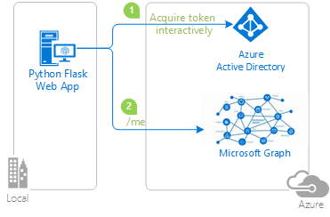

### Overview

This sample demonstrates a Python web application that signs-in users with the Microsoft identity platform and calls the [PAT lifecycle management API for Azure DevOps]("https://docs.microsoft.com/en-us/rest/api/azure/devops/tokens/pats?view=azure-devops-rest-6.1")

1. The python web application uses the Microsoft Authentication Library (MSAL) to obtain a JWT access token from the Microsoft identity platform (formerly Azure AD v2.0):
2. The access token is used as a bearer token to authenticate the user when calling the Azure DevOps api.



### Scenario

This is used in order to get a view of all active Personal Access Tokens for a given organization.

## How to run this sample

To run this sample, you'll need:

> - [Python 2.7+](https://www.python.org/downloads/release/python-2713/) or [Python 3+](https://www.python.org/downloads/release/python-364/)
> - An Azure Active Directory (Azure AD) tenant. For more information on how to get an Azure AD tenant, see [how to get an Azure AD tenant.](https://docs.microsoft.com/azure/active-directory/develop/quickstart-create-new-tenant)


### Step 1:  Clone or download this repository

From your shell or command line:

```Shell
git clone https://github.com/Azure-Samples/ms-identity-python-webapp.git
```

or download and extract the repository .zip file.

> Given that the name of the sample is quite long, you might want to clone it in a folder close to the root of your hard drive, to avoid file name length limitations when running on Windows.

### Step 2:  Register the sample application with your Azure Active Directory tenant

There is one project in this sample. To register it, you can:

- either follow the steps [Step 2: Register the sample with your Azure Active Directory tenant](#step-2-register-the-sample-with-your-azure-active-directory-tenant) and [Step 3:  Configure the sample to use your Azure AD tenant](#choose-the-azure-ad-tenant-where-you-want-to-create-your-applications)
- or use PowerShell scripts that:
  - **automatically** creates the Azure AD applications and related objects (passwords, permissions, dependencies) for you
  - modify the applications' configuration files.

If you want to use this automation:

1. On Windows, run PowerShell and navigate to the root of the cloned directory
1. In PowerShell run:

   ```PowerShell
   Set-ExecutionPolicy -ExecutionPolicy RemoteSigned -Scope Process -Force
   ```

1. Run the script to create your Azure AD application and configure the code of the sample application accordingly.
1. In PowerShell run:

   ```PowerShell
   cd .\AppCreationScripts\
   .\Configure.ps1
   cd ..
   ```

   > Other ways of running the scripts are described in [App Creation Scripts](./AppCreationScripts/AppCreationScripts.md)

If you don't want to use this automation, follow the steps below.

#### Choose the Azure AD tenant where you want to create your applications

As a first step you'll need to:

1. Sign in to the [Azure portal](https://portal.azure.com) using either a work or school account or a personal Microsoft account.
1. If your account is present in more than one Azure AD tenant, select your profile at the top right corner in the menu on top of the page, and then **switch directory**.
   Change your portal session to the desired Azure AD tenant.

#### Register the Python Webapp (python-webapp)

Use the steps below or visit [Manage personal access tokens (PATs) using REST API](https://docs.microsoft.com/en-us/azure/devops/organizations/accounts/manage-personal-access-tokens-via-api?view=azure-devops)

1. Navigate to the Microsoft identity platform for developers [App registrations](https://go.microsoft.com/fwlink/?linkid=2083908) page.
1. Select **New registration**.
1. When the **Register an application page** appears, enter your application's registration information:
   - In the **Name** section, enter a meaningful application name that will be displayed to users of the app, for example `python-webapp`.
   - Change **Supported account types** to **Accounts in any organizational directory and personal Microsoft accounts (e.g. Skype, Xbox, Outlook.com)**.
   - In the Redirect URI (optional) section, select **Web** in the combo-box and enter the following redirect URIs: `http://localhost:5000/getAToken`.
1. Select **Register** to create the application.
1. On the app **Overview** page, find the **Application (client) ID** value and record it for later. You'll need it to configure the Visual Studio configuration file for this project.
1. Select **Save**.
1. From the **Certificates & secrets** page, in the **Client secrets** section, choose **New client secret**:

   - Type a key description (of instance `app secret`),
   - Select a key duration of either **In 1 year**, **In 2 years**, or **Never Expires**.
   - When you press the **Add** button, the key value will be displayed, copy, and save the value in a safe location.
   - You'll need this key later to configure the project in Visual Studio. This key value will not be displayed again, nor retrievable by any other means,
     so record it as soon as it is visible from the Azure portal.
1. Select the **API permissions** section
   - Click the **Add a permission** button and then,
   - Select Add a permission and select Azure DevOps -> check user_impersonation -> select Add permissions.

### Step 3:  Configure the sample to use your Azure AD tenant

In the steps below, "ClientID" is the same as "Application ID" or "AppId".

#### Configure the pythonwebapp project

> Note: if you used the setup scripts, the changes below may have been applied for you

1. Open the `app_config.py` file
1. Fill in the ORGANIZATION variable
2. Fill in the AAD_TENANT_ID variable: [How to find your tenant ID - Azure Active Directory](https://docs.microsoft.com/en-us/azure/active-directory/fundamentals/active-directory-how-to-find-tenant)


### Step 4: Run the sample

- You will need to install dependencies using pip as follows:
```Shell
$ pip install -r requirements.txt
```

or
```Shell
# pip3 install -r requirements.txt
```

Run app.py from shell or command line. Note that the host and port values need to match what you've set up in your redirect_uri:

```Shell
$ python app.py
```
### Step 5: Open localhost:5000 in a browser

- Open a browser and navigate to localhost:5000
- The report will start generating and populating the table. Once the table is finished populating, there will be an Excel file in the root directory of the app. You can also use the controls in the completed table on the webpage to filter or sort tokens.

## More information

For more information, see MSAL.Python's [conceptual documentation]("https://github.com/AzureAD/microsoft-authentication-library-for-python/wiki"):


For more information about web apps scenarios on the Microsoft identity platform see [Scenario: Web app that calls web APIs](https://docs.microsoft.com/en-us/azure/active-directory/develop/scenario-web-app-call-api-overview)

For more information about how OAuth 2.0 protocols work in this scenario and other scenarios, see [Authentication Scenarios for Azure AD](http://go.microsoft.com/fwlink/?LinkId=394414).
